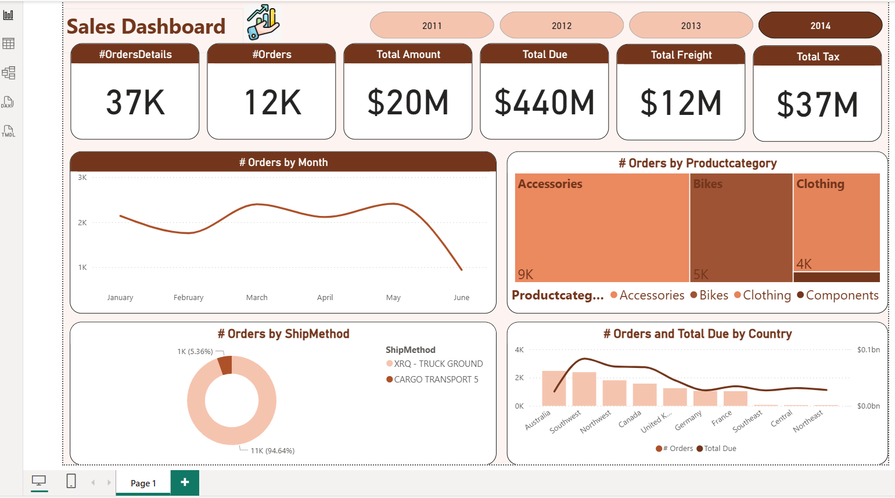

# first-project-power-pi-by-extract-data-from-SQL
Overview

This project is a fully interactive Sales Analytics Dashboard built using Power BI.
The data was extracted directly from SQL Server, cleaned using Power Query, modeled inside Power BI, and analyzed using DAX measures.
The dashboard provides a comprehensive view of sales performance across years, product categories, countries, and shipping methods.

Features
1. Key Performance Indicators (KPIs)

The dashboard includes a full KPI section displaying:

Total Orders

Orders Details

Total Amount

Total Due

Total Freight

Total Tax

These KPIs give users a clear and immediate understanding of overall business performance.

2. Year-Based Filtering

Interactive buttons (2011–2014) allow users to filter all visuals by year and compare performance across time.

3. Orders by Month

A line chart showing monthly order trends to help identify growth patterns, seasonality, and performance changes.

4. Orders by Product Category

A treemap that visualizes category-level insights across:

Accessories

Bikes

Clothing

Components

This helps identify best-selling product categories.

5. Orders by Shipping Method

A donut chart comparing shipping methods and highlighting customer preferences.

6. Orders & Total Due by Country

A combined bar + line chart showing both:

Number of orders

Total Due amount

This supports geographic analysis and reveals high-performing regions.

Data Source & Processing
• Data Extraction

The dataset was retrieved from SQL Server using direct connection and SQL queries.

• Data Cleaning

Performed in Power Query, including:

Removing nulls

Standardizing fields

Adjusting data types

Preparing tables for modeling

• Data Modeling

A structured star-schema style model was created inside Power BI with clear relationships between fact and dimension tables.

• DAX Measures

Several DAX measures were written to support KPI calculations and dynamic visuals.

Value for the Client

This dashboard enables the client to:

Gain instant visibility into key sales metrics

Identify the best performing products and regions

Track business performance across months and years

Understand customer shipping behavior

Make informed, data-driven decisions

Improve forecasting and strategic planning

The dashboard is optimized for clarity, performance, and ease of use.

Project Files

SalesDashboard.pbix → (Uploaded in this repository)

Screenshot (Optional)

You can add a screenshot here later by uploading an image:

How to Use

Download the .pbix file from the repository

Open it using Power BI Desktop

Refresh data if needed

Interact with filters, slicers, and visuals to explore insights
